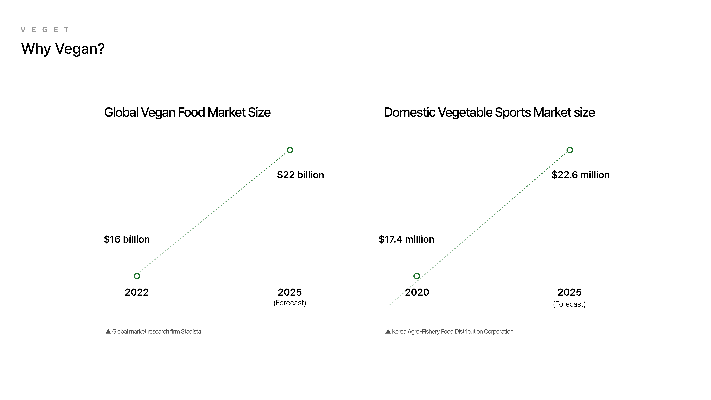

# VEGET

A built-in Kiosk service in vegetarian restaurant encouraging features of cooking robot system to create a hostile environment for mechanical cooking

## 💻 Developers

<table>
    <tr align="center">
        <td><B>PM</B></td>
        <td><B>Designer</B></td>
        <td><B>FE</B></td>
        <td><B>BE</B></td>
        <td><B>AI</B></td>
    </tr>
    <tr align="center">
        <td><B>박소현</B></td>
        <td><B>김서하</B></td>
        <td><B>임채승</B></td>
        <td><B>김정인</B></td>
        <td><B>이서현</B></td>
    </tr>
    <tr align="center">
        <td>
            
        </td>
        <td>
            
        </td>
        <td>
            
        </td>
        <td>
            
        </td>
        <td>
           
        </td>
    </tr>
</table>

## ⚒️ Developer Environment

    

## 📌 Key Features

